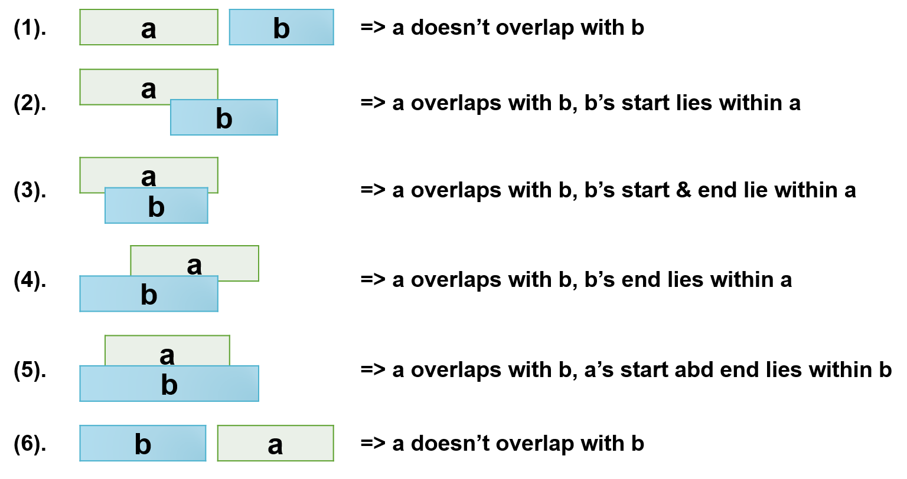

### Intervals Intersection

Given two lists of **arr1** and **arr2**, which contains two numbers for each, and all the numbers in eqch list are in increment order. Try to output list of the intervals intersection.

- arr1 = [1, 3], [5, 6], [7, 9]
- arr2 = [2, 3], [5, 7]
- output : [2, 3], [5, 6], [7, 7]

**Task**:
- With merge interval pattern, find overlapping intervals or merge intervals if they overlap, without any extra space

**Exercise**: [intersection.py](intersection.py)

Time complexity: O(n), N as the sum of arr1 length and arr2 length

Space complexity: O(1), no extra space

Constraints:
- 0 <= len(arr1), len(arr2) <= 1000
- for any [a, b], 1 <= a, b <= 1000
- for any [a, b], [c, d] in a list, a < b <= c < d (increment order)

<a class="return" href="../README.md" style="text-align:right;"> 《BACK》 </a>
