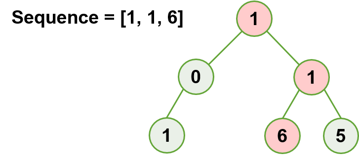

### Path with Correct Sequence

Given a binary tree and a number sequence, find if the sequence is present in the given tree.

- tree: [1] -> [0, 1] -> [1, null, 6, 5]
- sequence: [1, 1, 6]
- output: True

Task:
- With depth-first search, search through all root-to-leaf paths and find if the nodes match the given sequence.

Time complexity: O(n)
- n as the total number of nodes in the tree

Space complexity: O(1)
- no extra space

Constraints:
- 1 <= tree.level <= 100
- 1 <= treeNode.value <= 1000

<a class="return" href="../README.md" style="text-align:right;"> 《BACK》 </a>