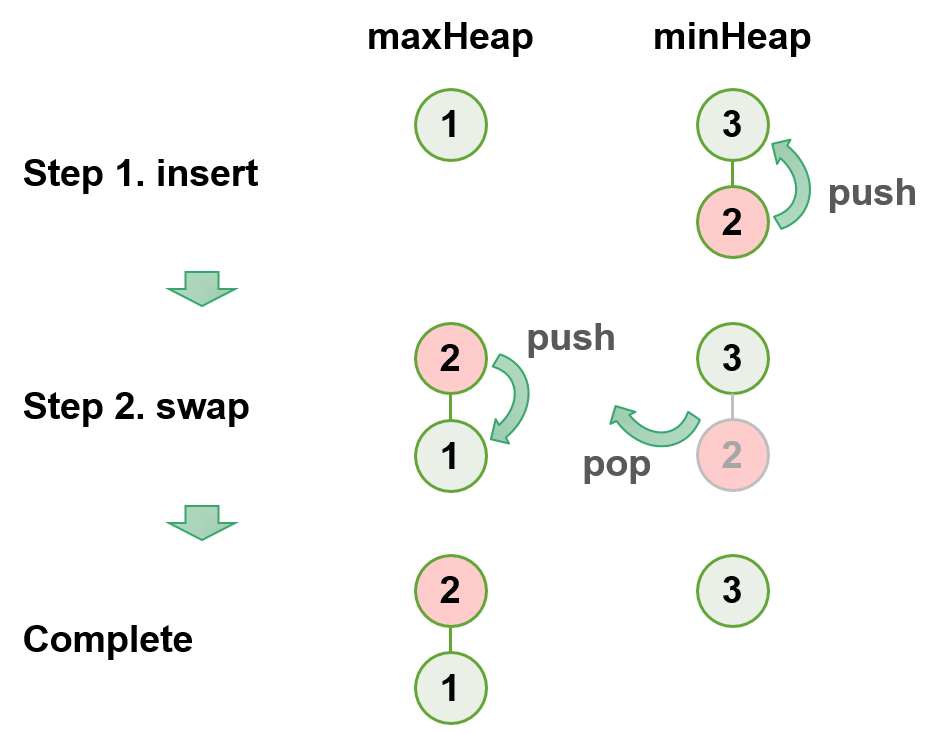

### Find the Median of a Number Stream

Given a series of **num** is handled by two actions step-by-step.

- insertNum(int **num**): stores the numbers
- findMedian(): returns the median of all numbers inserted in the class, or the average of the middle two numbers, if the count of numbers is even.

- 1. insertNum(3)
- 2. insertNum(1)
- 3. findMedian() -> output: 3
- 4. insertNum(2)
- 5. findMedian() -> output: 2
- 6. insertNum(4)
- 7. findMedian() -> output: 2.5

**Task**:
- Design a class which contains one maxheap and minheap to store every inserted number, and methods to calculate the median of a inserted numbers.

**Exercise**: [median.py](median.py)

Time complexity: O(nlogn)
- For inserting an item into a heap, the TC will be O(logn)
- For calculate the median, the TC will be only O(1)

Space complexity: O(n)
- n as the total number of num

Constraints:
- 1 <= total number of num <= 100
- 1 <= num <= 100

<a class="return" href="../README.md" style="text-align:right;"> 《BACK》 </a>
