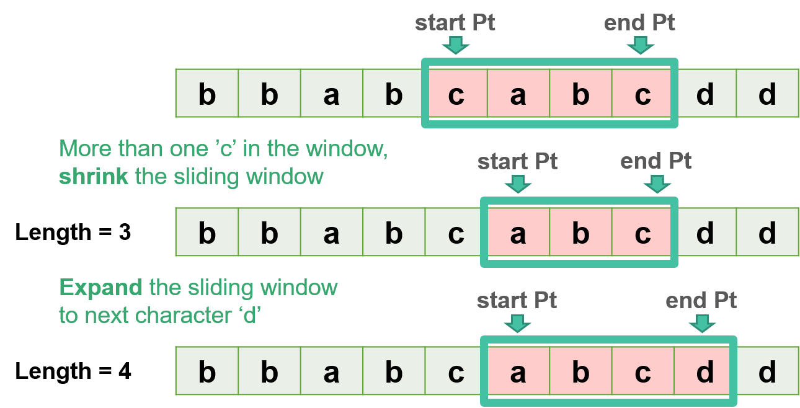
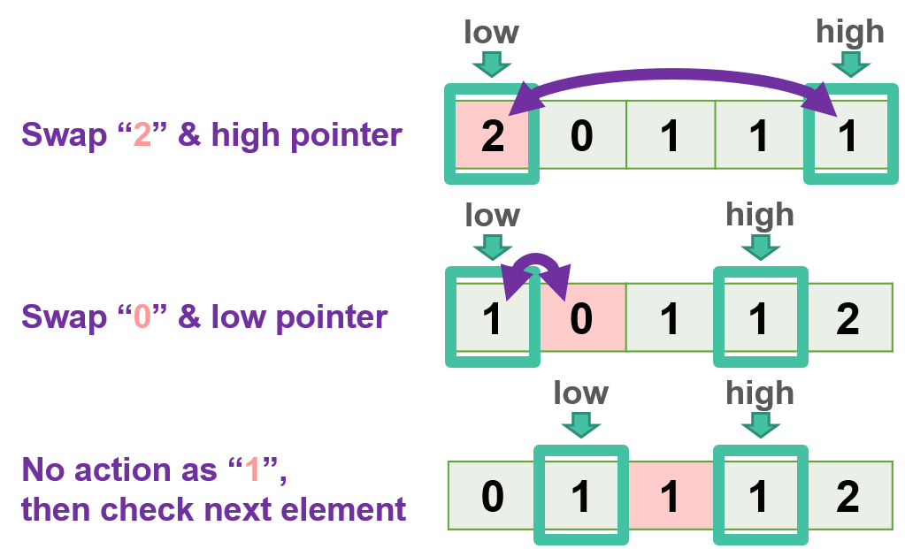
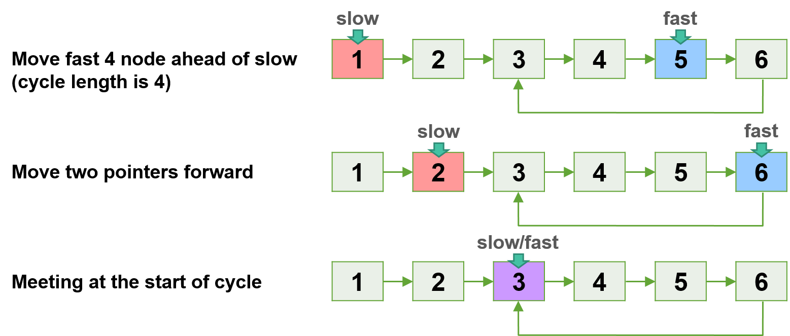
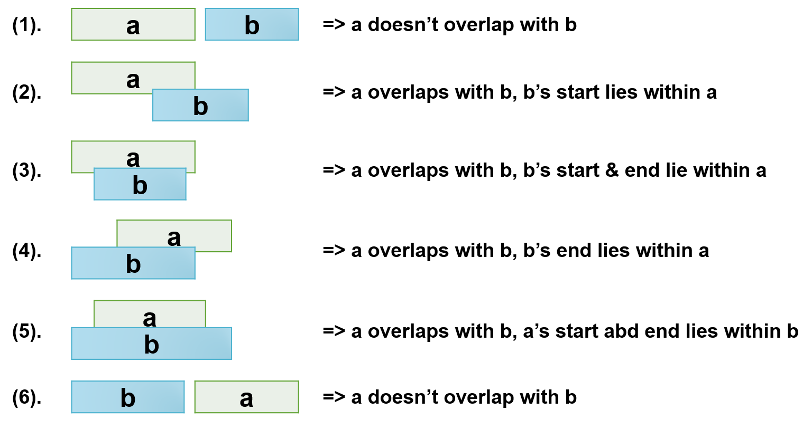
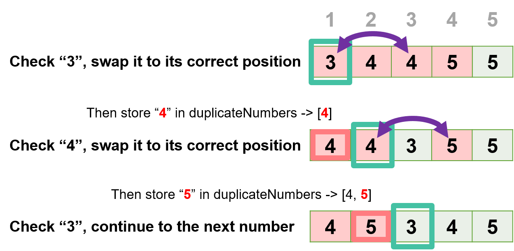
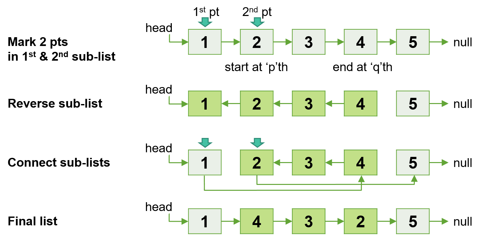
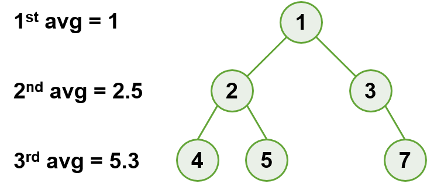
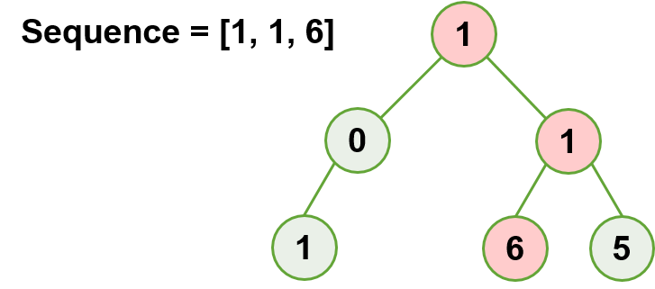
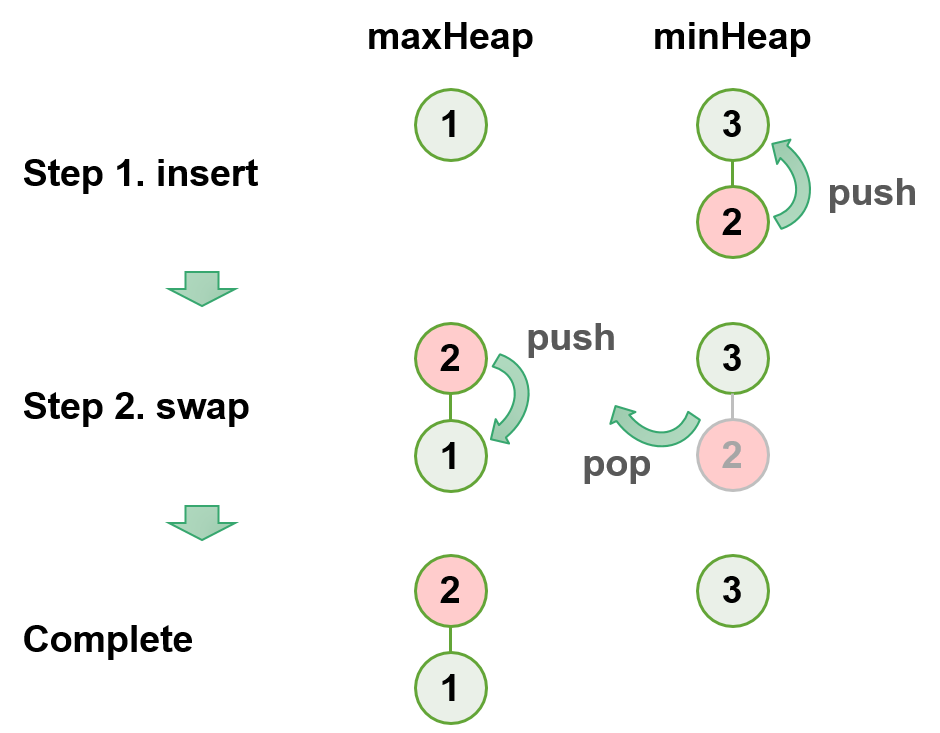
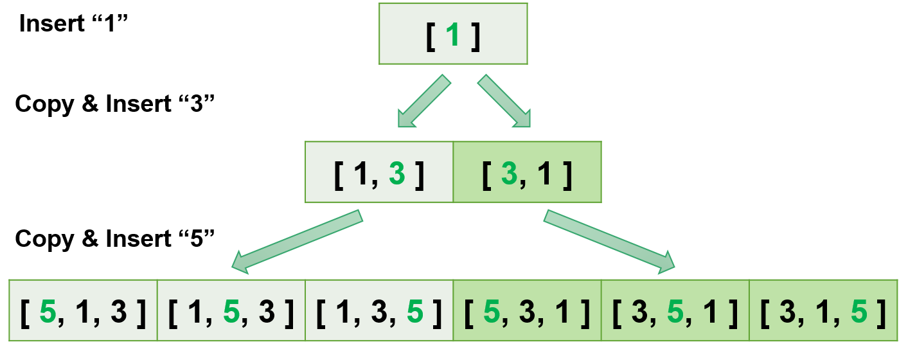

<h2 id="top"> Algorithms </h2>
Learning plan for top 16 algorithms and data structures. The goal is to develop an understanding of the underlying pattern and be able to solve a specific category of problems.

<a class="outlines" href="#sliding-windows">______ 01. Sliding Window</a> 
<a class="outlines" href="#two-pointers">______ 02. Two Pointers</a> 
<a class="outlines" href="#fast-slow-pointers">______ 03. Fast & Slow Pointers</a> 
<a class="outlines" href="#merge-intervals">______ 04. Merge Intervals</a> 
<a class="outlines" href="#cyclic-sort">______ 05. Cyclic Sort</a> 
<a class="outlines" href="#Reversal-linkedList">______ 06. In-place Reversal of a LinkedList</a> 
<a class="outlines" href="#bfs">______ 07. Breadth First Search</a> 
<a class="outlines" href="#dfs">______ 08. Depth First Search</a> 
<a class="outlines" href="#2heaps">______ 09. Two Heaps</a> 
<a class="outlines" href="#subsets">______ 10. Subsets</a> 
<a class="outlines" href="#binarySearch">______ 11. Binary Search</a> 
<a class="outlines" href="#bitwise">______ 12. Bitwise</a> 

#
<h3 id="sliding-windows"> Chapter 01. Sliding Window </h3>
A sliding window pattern will solve this problem in an more effecient way, <strong>time complexity O(n)</strong> - n as the size of the given array.
Compared with this, a basic brute force solution will be with time complexity O(nk) - k as the number of the targeted elements.

- Exercise: [Longest Substring without Repeating Characters](01_slidingWindow/)
- Input string = "bbabcabcdd"
- Output: 4
- Explain: the longest substring w/o repeating characters is "abcd", and the length is 4.

<a class="return" href="#top" style="text-align:right;"> 《TOP》 </a>

#
<h3 id="two-pointers"> Chapter 02. Two Pointers </h3>
If input array is sorted, an efficient way, <strong>time complexity O(n)</strong>, would be to with one pointer in the beginning and another pointer at the end. At every step, pointers iterate through the remaining elements, until these two pointers pointing to the same elements.

Compared with this, a basic brute force solution will be with time complexity O(n\*n), and a heapsort solution will be with O(n*logn).

- Exercise: [Dutch National Flag Problem](02_twoPointers/)
- Input array =  [2, 0, 1, 1, 1]
- Output array = [0, 1, 1, 1, 2]
- Explain: incrementally sort an array containing only three objects (labled as 0, 1 & 2)

<a class="return" href="#top"> 《TOP》 </a>

#
<h3 id="fast-slow-pointers"> Chapter 03. Fast & Slow Pointers </h3>
Setting two pointers with different move speed would be <strong>time complexity O(n)</strong> and with space complexity O(1), no extra space. 

- Exercise: [Start of LinkedList Cycle](03_fastSlowPointers/)
- LinkedList = 1 -> 2 -> 3 -> 4 -> 5 -> 6 -> 3
- starting node of cycle: 3
- Explain: Node 3 is start of cycle (3 -> 4 -> 5 -> 6 -> 3)

<a class="return" href="#top"> 《TOP》 </a>

#
<h3 id="merge-intervals"> Chapter 04. Merge Intervals </h3>
This would be an effecient way to deal with overlapping intervals with <strong>time complexity O(n)</strong> and space complexity O(1), no extra space.

- Exercise: [Intervals Intersection](04_mergeIntervals/)
- arr1 = [1, 3], [5, 6], [7, 9]
- arr2 = [2, 3], [5, 7]
- output : [2, 3], [5, 6], [7, 7]

<a class="return" href="#top"> 《TOP》 </a>

#
<h3 id="cyclic-sort"> Chapter 05. Cyclic Sort </h3>
With a given unsorted array, this would be an effecient way to sort and store all duplicate numbers with <strong>time complexity O(n)</strong> and space complexity O(1), no extra space.

- Exercise: [Find all Duplicate Numbers](05_cyclicSort/)
- nums = [3, 4, 4, 5, 5]
- output : duplicateNumbers = [4, 5]

<a class="return" href="#top"> 《TOP》 </a>

#
<h3 id="Reversal-linkedList"> Chapter 06. In-place Reversal of a LinkedList </h3>
An efficient pattern to implemnt in-place revere sub-list without extra space.

- Exercise: [Reverse a Sub-list](06_reversedList/)
- start to revere, p = 2
- end to reverse, q = 4
- input-list : 1 -> 2 -> 3 -> 4 -> 5 -> null
- output-list : 1 -> 4 -> 3 -> 2 -> 5 -> null

<a class="return" href="#top"> 《TOP》 </a>

#
<h3 id="bfs"> Chapter 07. Breadth First Search </h3>
Breadth First Search (BFS) technique provides a way to traverse a tree in a level-by-level order, and a Queue is used to keep track of all the nodes of a level.

- Exercise: [Level Averages in a Binary Tree](07_bfs/)
- tree: [1] -> [2, 3] -> [4, 5, null, 7]
- avg: [1, 2.5, 5.3]

<a class="return" href="#top"> 《TOP》 </a>

#
<h3 id="dfs"> Chapter 08. Depth First Search </h3>

Using recursion, Depth First Search (DFS) is the approach to keep track of all the nodes while traversing.

- Exercise: [Path with Correct Sequence](08_dfs/)
- tree: [1] -> [0, 1] -> [1, null, 6, 5]
- sequence: [1, 1, 6]
- output: True

<a class="return" href="#top"> 《TOP》 </a>

#
<h3 id="2heaps"> Chapter 09. Two Heaps </h3>

Creating two heaps to store the given number stream, the time complexity of this approach will be only O(nlogn), rather than brute-force solution with time complexity O(n*n)

- Exercise: [Find the Median of a Number Stream](09_twoHeaps/)
- 1. insertNum(3)
- 2. insertNum(1)
- 3. findMedian() -> output: 3
- 4. insertNum(2)
- 5. findMedian() -> output: 2
- 6. insertNum(4)
- 7. findMedian() -> output: 2.5

<a class="return" href="#top"> 《TOP》 </a>

#
<h3 id="subsets"> Chapter 10. Subsets </h3>

Similar with breadth-first search, this subsets approach provides a solution with time complexity O(n*n!)

- Exercise: [Permutations](10_subsets/)
- Input: **nums** = [1,3,5]
- Output: [1,3,5], [1,5,3], [3,1,5], [3,5,1], [5,1,3], [5,3,1]

<a class="return" href="#top"> 《TOP》 </a>

#
<h3 id="binarySearch"> Chapter 11. Binary Search </h3>

As the efficient searching algorithm, binary search provide a solution with time complexity, O(logn), for finding an item from a sorted list of items.

- Exercise: [Number Range](11_binarySearch/)
- **arr** = [4, 6, 6, 6, 9], key = 6
- Output: [1, 3]

<a class="return" href="#top"> 《TOP》 </a>

#
<h3 id="bitwise"> Chapter 12. Bitwise </h3>

With time complexity O(n), bitwise operatioin provides a method for these problems without extra space. Compared with it, another common method is to add every numbers in the given array, but the sum will be overflowed, if the numbers in the given array are large.

- Exercise: [Single Number](12_bitwise/)
- **arr**: 1, 4, 2, 1, 3, 2, 3
- Output: 4

<a class="return" href="#top"> 《TOP》 </a>
